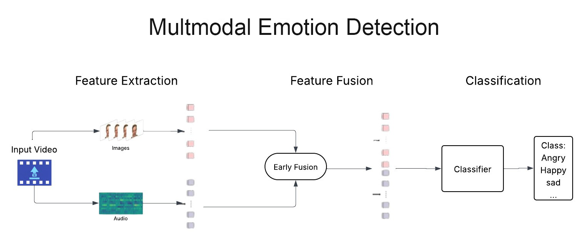

# 🎥 High-Accuracy Multimodal Emotion Detection from Video

This repository contains a complete **end-to-end system for Multimodal Emotion Detection**, designed to accurately classify human emotions from video clips by analyzing both **audio** and **visual** data streams.

The project implements an advanced pipeline that extracts **deep features** from facial expressions and **acoustic properties** from speech. These features are then combined using a novel **Multi-View Fusion model**. Finally, a powerful **Stacking Ensemble Classifier** is trained on the fused data to achieve **high-performance emotion recognition**.

---

## 🌟 Key Features

* 🧠 **Multimodal Analysis**: Leverages both audio and video channels to create a more robust and accurate understanding of emotional expressions.
* 🖼️ **Advanced Visual Feature Extraction**: Uses **VGGFace (ResNet-50)** with **Attention Pooling** to focus on the most expressive frames.
* 🎵 **Rich Audio Feature Extraction**: Employs **Librosa** to extract MFCCs, Spectral Centroid, ZCR, RMS, and more.
* 🔗 **Intelligent Feature Fusion**: Combines modalities using **Concatenation**, **Cross-Attention**, and a **Gated mechanism**.
* ⚙️ **High-Performance Modeling**: Achieves **state-of-the-art results** using a **Stacking Classifier** (SVM + RandomForest + XGBoost).

---

## 🔬 Project Pipeline

The process is divided into **four main stages**:

### **Stage 1: Data Preprocessing**

* **Frame Extraction**: Sample videos at **3 fps** and save frames.
* **Audio Extraction**: Extract audio as `.wav` files for acoustic analysis.

### **Stage 2: Feature Extraction**

* **Audio Features**: Extract **45 acoustic features** (MFCCs, ZCR, RMS, etc.) → saved as `ravdess_features.csv`.
* **Visual Features**:

  * Frames passed through **VGGFace (ResNet-50)**.
  * **Attention Pooling** aggregates expressive frames.
  * Final features saved as `video_features_vggface_attention.csv`.

### **Stage 3: Feature Fusion**

* **Dimensionality Reduction**: PCA → 300 components.
* **Scaling**: StandardScaler normalization.
* **Fusion Model**: Combines features via:

  * Concatenation
  * Cross-Attention (MultiHeadAttention)
  * Gated Fusion
* Final fused features saved as `fusion_features.csv`.

### **Stage 4: Modeling and Training**

* **Split data** into train/val/test.
* **Train Stacking Classifier**: (SVC + RandomForest + XGBoost → meta SVC).
* **Evaluate** on test set.
* **Save models** (scalers, PCA, fusion, stacking classifier).

---

## 📊 Results

**Final Test Accuracy:** `93.06%`

| Emotion   | Precision | Recall | F1-Score |
| --------- | --------- | ------ | -------- |
| Angry     | 0.97      | 0.89   | 0.93     |
| Calm      | 0.93      | 0.97   | 0.95     |
| Disgust   | 0.95      | 0.95   | 0.95     |
| Fearful   | 0.95      | 0.90   | 0.92     |
| Happy     | 0.97      | 1.00   | 0.99     |
| Neutral   | 0.94      | 0.89   | 0.92     |
| Sad       | 0.87      | 0.89   | 0.88     |
| Surprised | 0.88      | 0.92   | 0.90     |

---

## 🚀 How to Run

1. **Clone the Repository**

   ```bash
    git clone https://github.com/MohameddEzzatt/Multimodal-Emotion-Recognition.git
    cd Multimodal-Emotion-Recognition
   ```

2. **Create Virtual Environment (Recommended)**

   ```bash
    python -m venv venv
    source venv/bin/activate   # On Windows: venv\Scripts\activate
   ```

3. **Install Dependencies**

   ```bash
    pip install -r requirements.txt
   ```

4. **Download Dataset**

   * Download **RAVDESS dataset** from [RAVDESS Link](https://zenodo.org/record/1188976).
   * Extract into a folder: `RAVDESS dataset/` at the project root.

5. **Run Jupyter Notebook**

   ```bash
   jupyter notebook
   ```

   * Open **main.ipynb** and run cells sequentially.

---

## 🛠️ Technologies Used

* **Core Libraries**: Python, NumPy, Pandas
* **Machine Learning**: Scikit-learn, XGBoost
* **Deep Learning**: TensorFlow, Keras
* **Data Processing**: OpenCV, MoviePy, Librosa
* **Model Persistence**: Joblib

---

## 📜 License  

[](LICENSE)  

This project is licensed under the **MIT License**. See the [LICENSE](LICENSE) file for details. 
